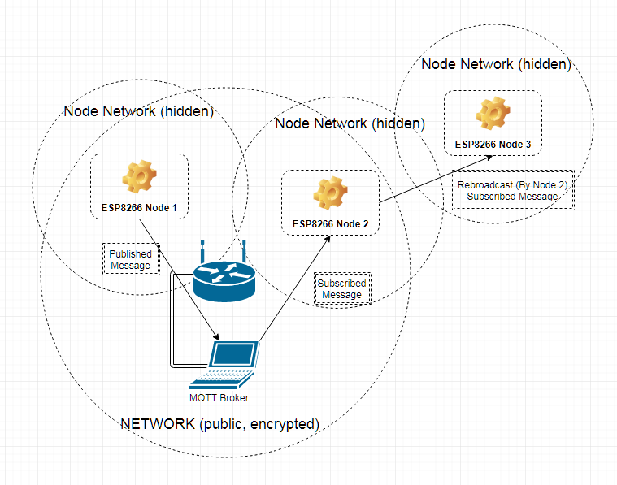

# Mesh Construction and Communication

Nodes always power up in Station mode.  Each node in the mesh will 1st try to connect to one of the configured WiFi access-points.i
If the node cannot see any APs, it will next attempt to connect to any nearby nodes.
A potential node is identified by having a hidden SSID and having a specific MAC address.
Each node constructs its MAC address by combining its chipId (upper 3 octets) with the mesh password and generating the lower 3 octets.
The connecting node will check each hidden network's MAC address by calculating the lower 3 octets and verifying that they match the
AP.  All matching nodes are sorted by signal strength, and the node will attempt to connect to each in order.

Once connected, the connecting node will then open a RCP connection on the specified port, and send the mesh password to the AP.  Next the
node will broadcast a MQTT message about its availability (ex `esp8266-out/bssid/aabbcc=00:11:22:33:44:55`).  This message is sent with the
retain bit set to preserve it on the broker, but it is never consumed by any other nodes.  Lastly, the node will start its own AP and begin
listening for connections from other nodes.

Each node can only handle 4 incoming commections, and will refuse connections once it has reached the limit.  While the max connection
count is limited by the ESP8266 core code.  The ESP8266MQTTMesh library also assumes this limit.

If a node loses its connection to the AP, it will also shutdown its own AP.  This will result in the subsection of the mesh reorganizing
and rebuilding automatically.  It is required that at least one node can see the WiFi AP at any time as the broker must be available
to handle message passing.

Mesh nodes cannot generally communicate directly with each other.  Instead all messages are passed through the MQTT broker.  Nodes
automatically subscribe to all topics beginning with the `in_topic` value (typically `esp8266-in/`).
